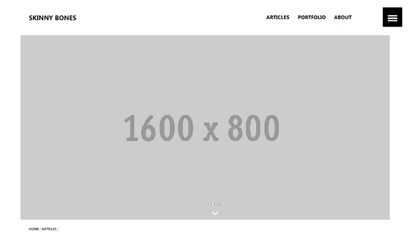

# Personal Blog: The Attempt

## What

Trying out personal blogging. Expose the yourself!

## Why

Using this as platform to not only blog but also after failing butt-down in swedish alphabet, I skip it to practice the easier Swedish writing of my fun, and Swedish experiences. Det är dags!

## Who

Inspired by the all-time [Dota 2](https://thealliance.gg/) fun and friend all teh way from [Jakarta](https://en.wikipedia.org/wiki/Jakarta), the man known to the inner circle as [Mr. T](http://yanuartadityan.github.io/). Wait a minute!!! Does he not look like [Mr. T](https://en.wikipedia.org/wiki/Mr._T). It is more than a year, Mr. T since you coined the term Jekyll, you do not even remember but here I am to remind you that your talk did not go to...... where do they always go :) hmm!!

## How

The project is based on the *now archived* `Skinny Bones Jekyll Starter`contribution by [Michael Rose](https://github.com/mmistakes). I forked the project more than a year ago but looking it now, it is more-or-less the same.

## Where

To learn more about how to use the theme and install it check out the [Skinny Bones demo](https://mmistakes.github.io/jekyll-theme-skinny-bones/).

## Är det allt?

Notable Features of the base framework include

* Jekyll 3.x and GitHub Pages compatible.
* Stylesheet built using Sass.
* Data files for easier customization of the site navigation/footer and for supporting multiple authors.
* Optional Disqus comments, table of contents, social sharing links, and Google AdSense ads.
* And more.
