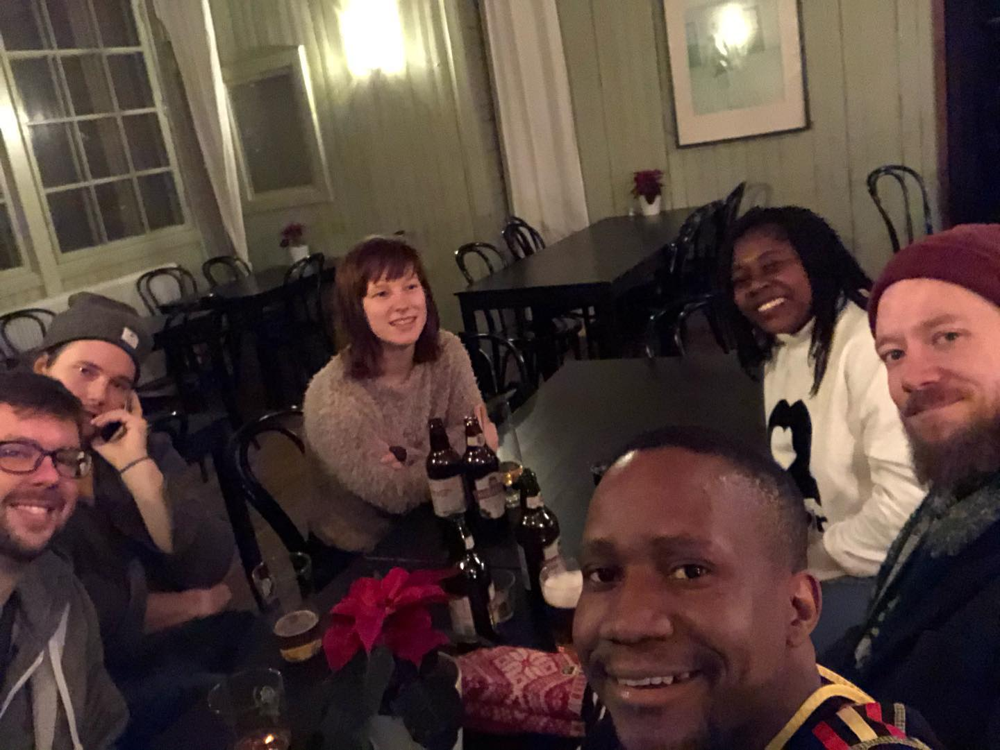

> ##### Förraveckan
>
> *Jag*: Jag blev inbjuden till kallbadhuset nästa vecka.  
> *Fru*: Vad är det för nånting?  
> *Jag*: Ett kall - bad - hus! Du vet! Ett hus där man kan hoppa i havet och *springa* till bastun, tror jag!  
&nbsp;&nbsp;&nbsp;&nbsp;>> *Då jag återberättade hur det går med bastun och går ner i havet och hur lite 'klädd' man är - eller inte.*  
> *Fru*: Så konstigt! Nej tack! Det går inte för mig. Ha det kullt!

> ##### Ett par dagar senare
>
> *Jag*: Nästa vecka ska jag hoppa i havet.  
> *Ddebi*: Oj oj oj! Du är galen som min man.  
> *Ddiba (Ddebis sötpatatis)*: Tänk om känslorna från din bästa massage och multiplicerar det av tio gånger. Nu vet du!  
> *Jag*: Vad kul! Punkt och slut!
>
> *OBS: Ddebi och Ddiba är* [nollåttorna](https://sv.wikipedia.org/wiki/Noll%C3%A5tta){:target="_blank"}.

### Kallbadhuset

Idag började som en vanlig dag; vaknade upp, steg upp, duschade mig, åt frukost, på ingen speciell ordning men idag fanns också ett sinnesförändring för min fru.

Vi gick tillsammans till [Riberborgs kallbadhuset](https://www.ribersborgskallbadhus.se/){:target="_blank"} i Malmö för att njuta av vinterns kallbad. För [Greta Thunberg](https://en.wikipedia.org/wiki/Greta_Thunberg){:target="_blank"}s skull är det bara en tjugo minuters promenad från Kronprinsen där vi bör. Det var inte så kallt som en vanlig vinterdag (4-5 grader) och det blåste inte så mycket heller.

På kallbadhuset betalade vi på receptionen och gick på olika håll. Min fru gick mot damerna till höger och jag gick mot herrar till vänster.

Jag klädde mig ner till min födelsedagsdräkt, duschade och gick fram till bastun för en sjuttio grader preparation.

#### Den första gången

Bastun var mysig. Det hade ett litet fönster till vänster vid spisen och ett stort fönster direkt framför bänkarna. Utsikten från det främre fönstret var jätteskönt och där kunde man bevittna himlen som det kysser den stora havsmassan. Vattnet hölls på plats av vackra stenar och allt var inslaget i en fönsterram just som en *nationella* vykort bild.

Efter femton minuter i bastun steg jag upp som jag var kallade av *Emily Rose*. Utan att säga någonting gick jag ut ur bastun och ut ur huset och sen fram till havet. Jag gick nerför trappan ett steg i taget. Min högra fot bröt först in i vattnet och sen min vänstra fot djupare och djupare för varje steg tills hela kroppen var under det kalla havsvatten. Oh katten!!! Vilken känsla! så ren, så klart, så jungfrun, något som jag aldrig har någonsin upplevt. Det var en uppvaknande av mina innersta känslor och under bara några sekunder kom jag ihåg att jag måste dra snabbt ut ur vattnet. Jag klättrade uppför trappan så snabbt som möjligt och...! Ja, det fanns ingen Emily Rose. Det var bara vikingan i mig.

Jag var lite nervös att hoppa i kall vatten men man måste vaga gör roliga saker, eller hur? Det var faktiskt vårmare i vattnet (4.6 grader) än ut i luften (3 grader) så varför göra det inte igen! Varje gång är intervaller av först bastun och sen hoppa i havet.

#### De andra gångerna

Jag gick fram till bastun den andra gången och träffade mina två långa (både i höjd och i skägg längd - det nog tar drygt 10 år för mig) kompisar Mike och ~~Viktor~~ Victor. Sen gick vi direkt till havet. Denna gång hade en liten vridning, gå nedför trappan på vänster sidan, simma i vattnet för en liten stund, sväng tillbaka och klättrade uppför på höger sidan. Ser du vridningen? Nej? bra! Du ska bli väl!

För min tredje gången, ur bastun, träffade vi en ny kompis, Joel, som just hade kommit in i kallbadhuset. Han gick direkt till havet utan att vårma sig själv i bastun, så jävla galen! Mitt mål i 10 år i framtiden 😀😀.

Vi gick till bastun och en stund i kallt havet för två gånger till. På varje gång kände mig bättre och bättre i vatten, och precis efter jag var ut ur vattnet.

#### Vedeldad badtunna upplevelse

Efter bastun, den fjärde gången, gick jag och Mike inn i en vedeldad badtunna. Det var min första gången någonsin och det kändes jättejättekul. Luften var kall som förra men vattnet var lagom varmt och jag satt i en av de två hörnen i badtunnan. Vatten skjutade fram till min rygg och det kändes som en mild massage. Det är ju sant att '*lagom är bäst*'. Jag kollade upp och kunde inte ser några fåglar i himlen. Himlen var nu mörkt. Jag stängde ögonen och lyssnade till mina inner känslor. Jag blev en med känslorna och de var en med jag! En sådan stund, utan något runt, bara jag och mina känslor i luften, i rymden! *En typ yoga*.

> *En man*: Ursäkta! Ursäkta! Finns det en plats till i badtunnan?  
> *Jag*: Ja visst!  
&nbsp;&nbsp;&nbsp;&nbsp;&nbsp;&nbsp;>> *Mitt riktigt tänke*: Jag är i meditation, varför hoppa du inte i havet istället! huh???

Det var 20-30 minuter i badtunna.

*Källa: [https://www.bygghemma.se](https://img.bygghemma.se/pimages/badtunna-polhus-polartunnan-original__e4a03d73-5c52-46bf-a71e-778e98b25fdb.jpg?auto=format,compress&w=634&h=634&dpr=1){:target="_blank"}*

#### Kvällens avslutning

Därefter samlade vi på *Restaurangen Ribersborg* och umgås medan vi drack ett par öl. Det var jätteroligt att höra av min frus upplevelse. Faktiskt hoppade hon också i vattnet fem gånger. Det var ju mer intressant för henne än jag eftersom hon trodde att hon kunde aldrig någonsin hoppa i kallt havet. Kvällen slutade på *[Bronx Burgers](https://bronxburgers.se/)* i Centrala Malmö där jag åt min bästa vegansk burgare (Beyond Luleå).

|  |  |
| *Ölfolk på Ribban* | *Burgarefolk på Bronx* |

### Var ligger Ribersborgs kallbadhuset

<iframe src="https://www.google.com/maps/embed?pb=!1m18!1m12!1m3!1d9016.093192695429!2d12.967147460043678!3d55.60160818229347!2m3!1f0!2f0!3f0!3m2!1i1024!2i768!4f13.1!3m3!1m2!1s0x4653a6a667a5ce0f%3A0x2612925a8f0058b6!2sRibersborgs%20Kallbadhus!5e0!3m2!1ssv!2sse!4v1578011036765!5m2!1ssv!2sse" width="800" height="450" frameborder="0" style="border:0;" allowfullscreen=""></iframe>

### Vad nu?

Ett tio gång klippkort? Kanske kanske. Vi hörs snart! 😀😀

### Att-göra-innan-jag-dör-lista
- [Hoppa i havet](https://www.facebook.com/bbccomedy/videos/337115390412572/?v=337115390412572){:target="_blank"}: *Markerad!*

*Tack för att du läser!*
