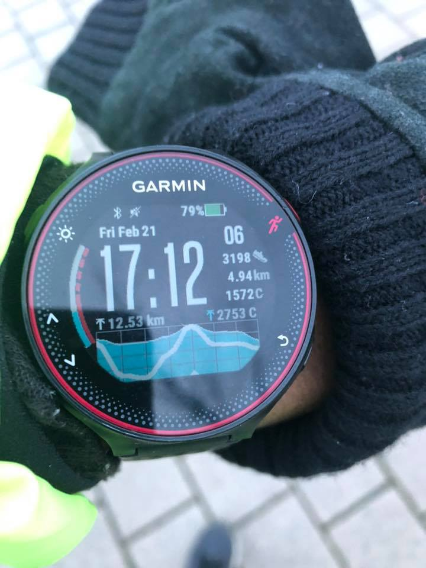
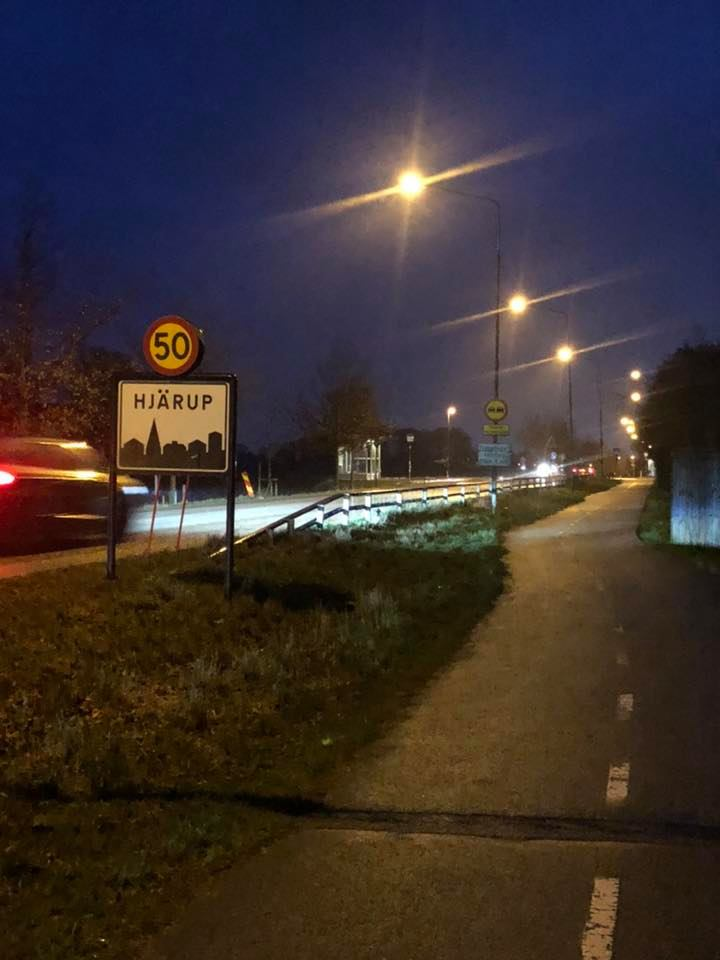
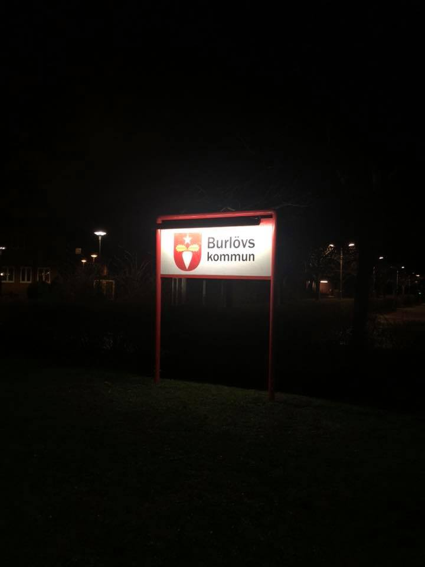
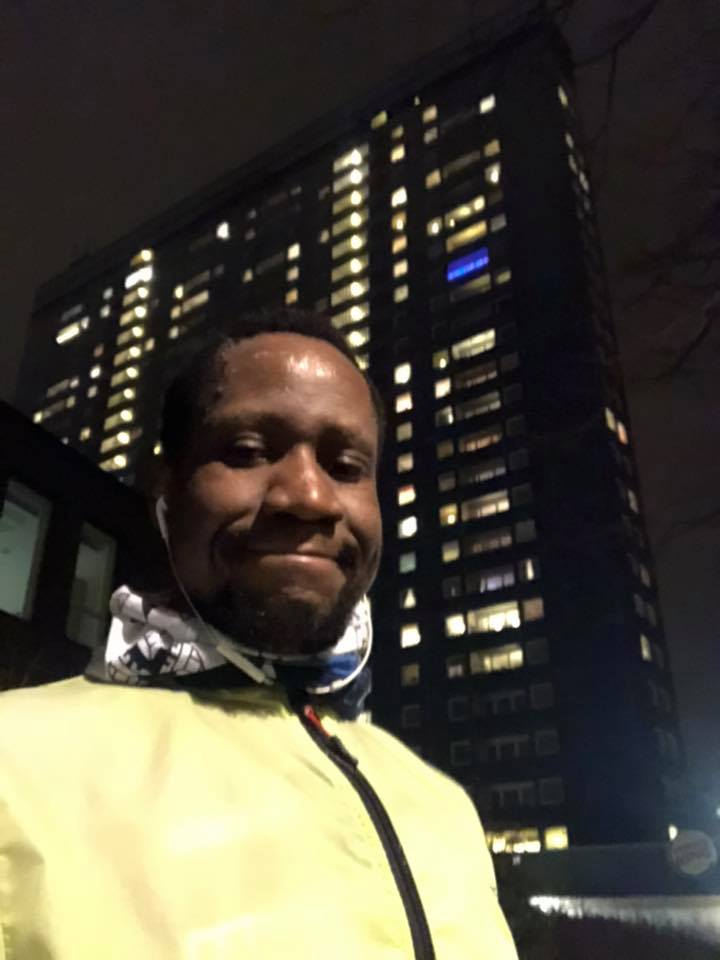

Jag pendlar mellan Malmö och Lund varje vardag. Det brukar ta drygt 50 minuter med bussen dörr till dörr men sista fredagen tog mig mer än 30 minuter p.g.a en olycka på vägen.  Igår, en torsdag, tog det nästan samma tiden. Jag såg en trend och så, upp med hakan, *en man som heter Josefsson* hade en sak att bestämma sig. Enkel logik leder till ett enkelt beslut.

På fredags, efter jobbet i <i>**Lund**</i>, stängde jag av arbetsdatorn och jag bytte kläder till mina springkläder - *jag hade ju hela helgen på mig*.

Exakt vid klockan tolv over fem, bytte jag till P4 <i>**Malmö**hus</i> på mobilen. Samtidigt tog jag mitt... 
&nbsp;&nbsp;&nbsp;&nbsp;*första,* 
&nbsp;&nbsp;&nbsp;&nbsp;&nbsp;&nbsp;&nbsp;&nbsp;*andra,* 
&nbsp;&nbsp;&nbsp;&nbsp;&nbsp;&nbsp;&nbsp;&nbsp;&nbsp;&nbsp;&nbsp;&nbsp;*tredje,* 
&nbsp;&nbsp;&nbsp;&nbsp;&nbsp;&nbsp;&nbsp;&nbsp;&nbsp;&nbsp;&nbsp;&nbsp;&nbsp;&nbsp;&nbsp;&nbsp;*...* 
&nbsp;&nbsp;&nbsp;&nbsp;&nbsp;&nbsp;&nbsp;&nbsp;&nbsp;&nbsp;&nbsp;&nbsp;&nbsp;&nbsp;&nbsp;&nbsp;&nbsp;&nbsp;&nbsp;&nbsp;*21,403:e steg.*

|  |    |     |        |
| *Från Lund* | *genom Hjärup* | *och Burlöv* | *till Malmö* |

Jag sprang längs Tunavägen via Tunaparken, och jag svängde till vänster vid Botaniska trädgården. Jag fortsatt söderut via Störa Södergatan till ... Sparbanken Arena. *Milda makter! blev jag just vilse i Lund? Google kartor, google kartor...*

Snart efter arenan började det att duggregna, genom Klostergården till och med Hjärup. Med öppna armar, sprang jag motvind medan det blåste, lik som ett barn springande mot sitt mamma. Ytterligare, blåst det starkaste runt Hjärup p.g.a mycket jordbruksmark till vänster.

Sen, en man som heter Jösefsson fått ett tusen tankar. Snart som möjligt ringde han sin fru och pratade om... [exakt] inget. Snart sprang han förbi Åkarp, Arlöv, Burlöv och sen Värnhem, <i>**Malmö**</i>, - bara 3.2 km kvar.

Äntligen, efter 2,3 mil på 5'58" tempo, var jag på Hästhagens IP. Jag var svettig och för trött men jag var mycket nöjd. Jag behövde att sträcka. Jag har ett träningsgymkort som jag sällan använder trots att gymet ligger precis på bottenvåningen av bostadsområdet men äntligen skulle jag använda det.

>\> *Jag kom, jag såg och jag erövrade.*

<iframe width="560" height="315" src="https://www.youtube.com/embed/B82kL6eXyh4" frameborder="1" allow="accelerometer; autoplay; encrypted-media; gyroscope; picture-in-picture" allowfullscreen></iframe>
 
Efter rundan fick jag en fråga från min kompis, [William](https://hejsweden.com/en/swedish-names-lists-statistics/).
> ##### Samtalet
> *William*: Är bussbiljetterna verkligen sånt dyr mellan Lund och Malmö att du måste springa?  
> *Jag*: Nej! Det är fredag så är det mycket trafikstockning. 
> &nbsp;&nbsp;&nbsp;&nbsp;&nbsp;&nbsp;&nbsp;*Tänk om all gjorde så!* 
> *William*: Bwahahahahahaha - *skrattar tillsammans med axlarna.*
