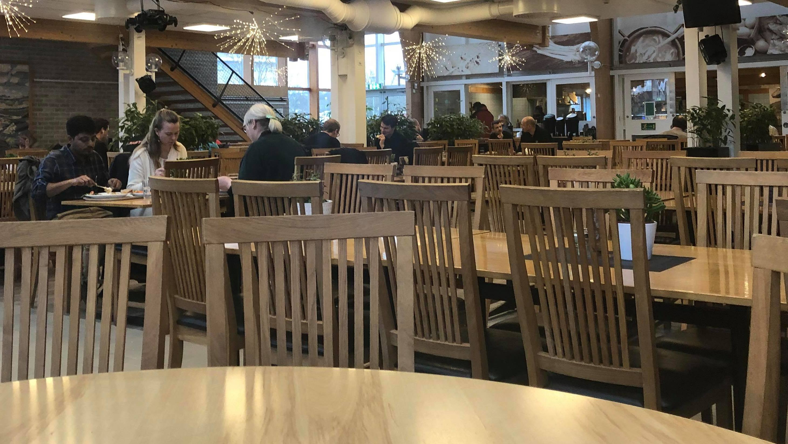

~~~~~~
OBS: Läsares diskretion rekommenderas!
~~~~~~

Det var en måndag [*fy* sjutton](https://www.svt.se/nyheter/inrikes/fy-sjutton-vilka-konstiga-svordomar){:target="_blank"}*de* february. Vid sjutton över sju på morgonen cyklade jag hemifrån till den Malmö stadshuset buss hållplatsen. Utan tvekan fanns där färre personer *- just det -* än vanligt som väntade på bussen till Lund. När bussen kom, hoppade jag på bussen och jag höll mitt månadskort på biljetapparaten.
> *Peeeeeee*!!!!  
  Vilket konstigt ljud det var! Men idag, spelar det ingen roll.

|  |  |
| *Vanliga veckor* | *Vecka 8* |

Jag gick mot baksidan i bussen medan jag räknade *en, två, tre,... fy sjutton* passagerare. Bussen är ofta fullsatt men idag är vi bara sjutton passagerare ombord. Fick jag inte memo?

***>> Snabbspola till jobbet***

Sen på arbetsplatsen gick jag upp i trappan steg för steg lade. Jag fortsatt direkt fram till rockhängaren. Det var färre jackor som vanligt. Vad *sjutton också* som händer? Missade jag ett larm angående coronavirus? Undrade jag.

|  |  |
| *Vanliga veckor* | *Vecka 8*  |

***>> Snabbspola till lunchen***

Vid lunchen på restaurangen, finns det alltid många person på i kö och man måste vänta för sin tur. Men då, [milda makter!], fanns det ingen i kö och vi gick direkt fram till att skaffa mat. Det fanns drygt sju personer i restaurangen.

|  |
| *Vecka 8* |

#### Förverkligande

Men vad hade jag inte uppfattat? Det var vecka åtta, en [sportlov](https://sv.wikipedia.org/wiki/Sportlov_i_Sverige) vecka i mest av skåne län. Det var lugnt överallt under hela veckan. Det påminner mig om min första gång på skidor för fyra år sen på [Hemsedal Skisenter, Norge](https://www.skistar.com/no/vare-skisteder/hemsedal/){:target="_blank"}.

|  |
| *Där inne finns en man som heter Josefsson på skidorna på Hemsedal Skisenter, Norge.  Foto av: Hillary Mutungi* |
