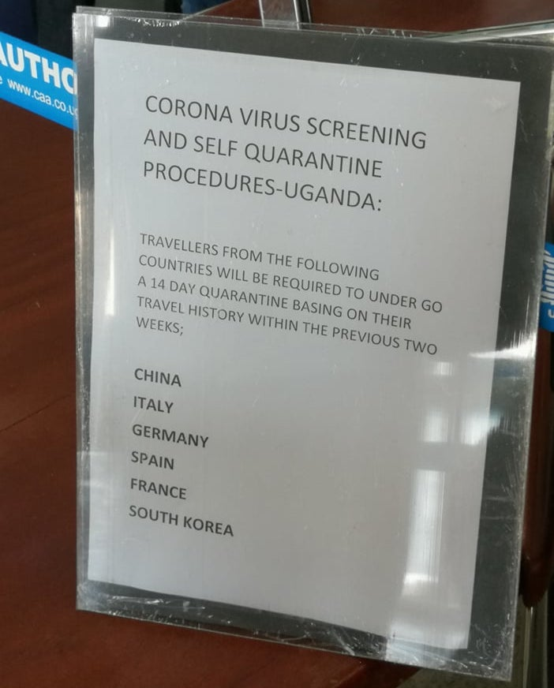

Så, min farbrors dotter är född och uppvuxen i Tyskland. Jag och *Nono* är ålder kompisar men vi lärde känna varandra för mindre än fyra år sen. En gång i mitten av 2000-talet reste hon till Uganda för en månad - hennes första gång. Då studerade jag på en internatskola (*'boarding school'* ugandiskt sammanhang) och vi träffade inte. Ungefär 15 år senare, träffade vi äntligen. Därefter träffar vi åtminstone en gång varje år.

Igår reste Nono till Uganda för sin andra gång i livet.

##### Dag 0 [1] av 20 i Uganda

Under resan kommunicerade vi lite grann via några facebook inläggen.
Men strax före immigrations personalen, bröt hela helvetet lös.

> ##### Återberättelse
>
> *Nono*: Kusin, jag behövde din hjälp.  
> *Jag*: Jaså, vad är den som hände?  
> *Nono*: Precis efter jag var på [Entebbe flygplats](https://en.wikipedia.org/wiki/Entebbe_International_Airport){:target="_blank"} sa personalen att jag måste göra en medicinsk screening till *coronaviruset* OCH stanna i karantän för två veckor.  
> *Jag*: Varför då?  
> *Nono*: Personalen sa så eftersom jag är tysk och det fanns flera fall av smittad individer i Tyskland.  
> *Jag*: Oj oj oj! Vad för fan hände efteråt?  
> *Nono*: Det här och det där, här och där ...

*Corona-kontrollmeddelande på Entebbe flygplatsen.* 
*Foto av: Noemi Mukama*

