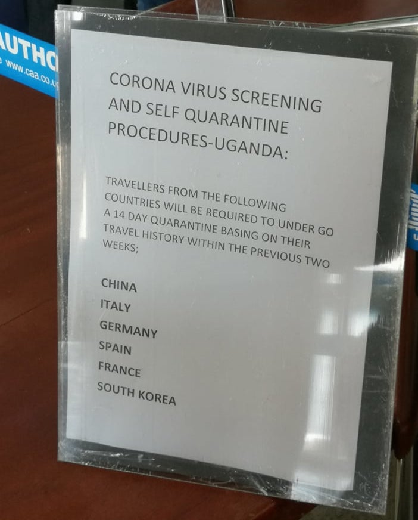

Så, min farbrors dotter är född och uppvuxen i Tyskland. Jag och *Noémi* är ålder kompisar men vi lärde känna varandra för mindre än fyra år sen. En gång i mitten av 2000-talet reste hon till Uganda för en månad - hennes första gång. Då studerade jag på en internatskola (*'boarding school'* på ugandiskt sammanhang) och vi träffade inte. Ungefär 15 år senare, träffade vi äntligen. Därefter träffar vi åtminstone en gång varje år.

Igår reste Noémi till Uganda för sin andra gång i livet.

*OBS: [Mzungu](https://en.wikipedia.org/wiki/Mzungu){:target="_blank"} är en vittperson mest från europa eller USA. Är det du?*

##### Dag [0]1 av 20, en lördag - Välkommen till Uganda!

Under resan kommunicerade vi lite grann via några facebook inläggen.
Men strax före immigrations personalen, bröt hela helvetet lös.

> ##### Återberättelse
>
> *Noémi*: Kusin, jag behövde din hjälp.  
> *Jag*: Jaså, vad är den som hände?  
> *Noémi*: Precis efter jag var på *Entebbe flygplats* sa personalen att jag måste ta en medicinsk screening till *coronaviruset* OCH stanna i karantän i två veckor.  
> *Jag*: Varför då?  
> *Noémi: Personalen pekade på en skylt.* 
> *Noémi*: Personalen sa det eftersom jag är tysk och det fanns flera fall av smittad individer i Tyskland.  
> *Jag*: Oj oj oj! Vad för fan hände efteråt?  
> *Noémi*: Det här och det där, här och där ...  
> ***>>Senare: på kvällen**  
> *Jag*: Hallå!!  
> *Noémi: Inget svara.*  

Till slut, gick allt bra för Noémi men den dagen fick jag inte detaljerna.

&nbsp;&nbsp;&nbsp;&nbsp;&nbsp;&nbsp;&nbsp;&nbsp;

&nbsp;&nbsp;&nbsp;&nbsp;&nbsp;&nbsp;&nbsp;&nbsp;*Corona-kontrollmeddelande på Entebbe flygplatsen.* 
&nbsp;&nbsp;&nbsp;&nbsp;&nbsp;&nbsp;&nbsp;&nbsp;*Foto av: Noémi Mukama*

##### Dag 2, en söndag, - Internationella Kvinnodagen

> *Jag*: Hallå!! x 2  
> *Noémi: Inget svara.*  

*Jag började [låta som Adele](https://www.youtube.com/watch?v=hLQl3WQQoQ0){:target="_blank"} men [tyvärr] min röst är faktiskt inte lika vacker.*  

##### Dag 3 - Äntligen, en måndag

> *Jag*: Hallå!  
> *Noémi*: Okobaki muna!  
> *Jag*: Snyggt!! Nu kan du *[Lusoga](https://en.wikipedia.org/wiki/Soga_language){:target="_blank"}* [mödersmål].  
> *Kom till saken* 
> *Jag*: Såååå min syster, vad är det verkligen som hände? Berätta allt.  

Hur som helst, återberättade Noémi att eftersom hon var jättetrött ur resan, hörde hon bara att *'du måste stanna i karantän i två veckor'*. Men hon fyllde bara i ett blanket och lyckades på screeningen. Sen lärde hon känna flera kusiner som hade kommit att välkomna henne till *'The pearl of Africa'*.

På fredagskvällen och på söndags var hon utan nätet. På den tredje dagen, åkte Noémi med en kusin till *Kampala centralen*. Sen så behövde Noémi ett ugandiska simkort.

Väl väl väl! Nu behöver du ditt pass att få att simkort sen så måste du betala daglig [eller varje vecka eller varje månad] skatt för att få tillgång till sociala medier. *Välkommen igen till Uganda - skrattande*. Kusinen hjälpte att få ett simkort med använd av sina uppgifter.

I slutet ordnade det sig.

##### Dag 4 - en tisdag

Det var en runda till till centralen. Där promenerade de runt Kampalas gatorna till och framför [Ugandas Riksdagshuset](https://en.wikipedia.org/wiki/Parliament_of_Uganda){:target="_blank"}*. Ja!!! Jag måste ta en stund här.

Noémi stöd framför riksdagshuset för att ta en foto. Genast efteråt kom polisen ur den riksdagshuset ingången. *Du kan inte ta bilder framför riksdagshuset utan att få tillåtelse. Du är arresterad,* sa polisen. Det säger du inte, svarade hon.
Det blev skandalös. Till sist kom de överens med att radera bilden ur mobilen.

*Välkommen igen till Uganda - Du missade det för mycket och det missade också dig.*

##### Dag 5 - God fortsättning!

Noémi har många intressanta upplevelser i Uganda som jag mig själv inte upplevde. Kanske ska hon skriva sin upplevelser i sina egna ord. Vi hörs om hennes historier inom tre eller fyra veckor. Under tiden, ska jag ta denna möjlighet att återberätta till min fru och vi ska skratta ensamma. 😀😀

*Noémi, välkommen igen till Uganda - en gång till.*

&nbsp;&nbsp;&nbsp;&nbsp;&nbsp;&nbsp;&nbsp;&nbsp;
