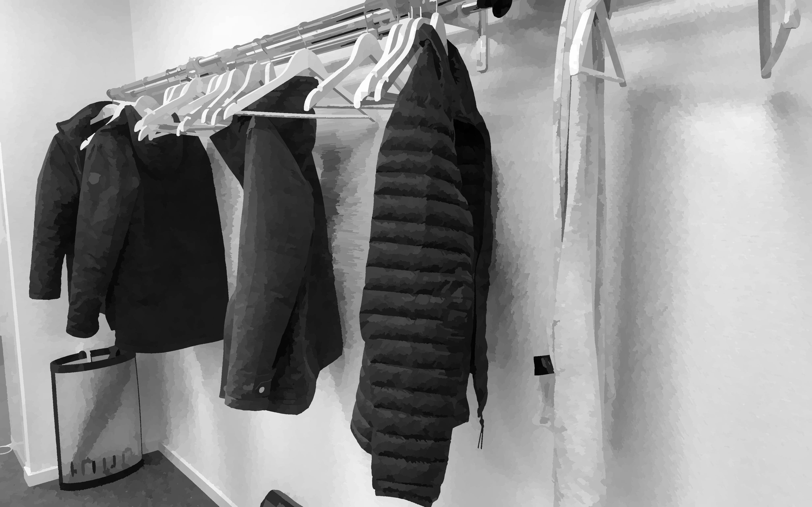
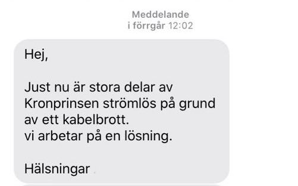

Tidigare i veckan, efter coronaviruset situation i Skåne förändrade med en ökning i siffrorna av smittad personer, kom rekommendation från styrelsen att alla kunde jobba hemifrån en eller två dagar i veckan. *Yahooooooo*, tänkte jag.

[Karensdagen](https://www.xn--fackfrbund-icb.com/fr%C3%A5gor-svar/vad-%C3%A4r-karensdag){:target="_blank"} - för ett par dagar sen, läste jag att [karensdagen slopas omedelbart](https://www.aftonbladet.se/nyheter/samhalle/a/pLkV4o/karensdagen-slopas-omedelbart){:target="_blank"}. Skit blev precis riktigt, tänkte jag.

***>> På onsdags***

Hur som helst, på onsdags jobbade jag hemifrån. Under dagen hörde jag mycket oljud från grannarna.

> *Jag*: Det är för högt, tyckte jag.  
> *Fru*: Nej, det är inte högt idag. 
> *Jag*: Oljudet kommer från lägenhet till vänster.  
> *Fru*: Nej, det kommer från lägenheten övanför. Är du *'ljudblind'*?  
> *Jag*: Det säger du inte. Det kan vara. 

***>> På torsdags***

På torsdags morgon bitti hade jag en sak att göra i Lund. Så åkte jag till Lund som vanligt. Det var färre personer än på [sportlovsvecka 8]({{ site.url }}/4/){:target="_blank"}. Det var otrolig att ser tomheten på gatorna och såna färre personer på bussen och på jobbet.

Medan jag gick längs bussen att sitta, höstade någon. '[Det var inte jag, det var inte jag](https://www.youtube.com/watch?v=Z_4ca8jthAs&feature=youtu.be&t=18){:target="_blank"}' tyckte jag. På bara ett ögonblick, var det 'alla ögon på mig' medan flera blev nyfiken. Det låtade normalt men inte i dessa tider.

&nbsp;&nbsp;&nbsp;&nbsp;&nbsp;&nbsp;&nbsp;&nbsp;
&nbsp;&nbsp;&nbsp;&nbsp;&nbsp;&nbsp;&nbsp;&nbsp;*Så många personer på jobbet på torsdags.*

***>> På fredags***

På fredags jobbade jag hemifrån, IGEN. Vid klockan 8 var jag framför min dator, redo för min dagsarbete. Samtidigt startade oljudet från grannarna. Nu vet jag vad menade min fru på onsdags. Herregud var det fruktansvärt högt, liksom en sorts stor omkonstruktion oljud. Jag kollade på min mobil och mitt bostadsområde webbsida - ingen meddelande om det.

Oljudet gick upp och ner. När det gick ner kom ett annat, en hamring - '*duh duh duh...*'. Driver du med mig? Som om det inte räcker, kom ett kompletterande oljud - de borrar i väggen.

Vad gör de?
> Försöker de upptäcka en ny musikgenre bortom [EDM musik](https://youtu.be/BubwLnPcQjc?t=48){:target="_blank"}? undrade jag.

> Tror de att jag har [en dyr bil](https://www.youtube.com/watch?v=sH8uBtfTqA8){:target="_blank"} eller [ett guldvalv](https://www.youtube.com/watch?v=uw6jY3VuOcI){:target="_blank"} eller bara [ett kassaskåp](https://www.youtube.com/watch?v=imm6OR605UI){:target="_blank"} inne i min lägenhet att de borde borra min vägg?

> Byter de golvet i lägenheten? Kanske är lägenheten nu en möbler tillverkning butik?

Jag kunde inte prata på Skypemöten utan bara lyssna in. Borde jag åka till Malmö stadsbiblioteket? Tänk om all gjorde så i dessa tider.

Är det dags för mitt första arg lapp? - Skitsamma! En annan gång.

Fyra timmar senare kom meddelande från bostadsägaren. Det säger du inte! Är meddelandet för sent? Rller har grannarna brutit kabeln?

&nbsp;&nbsp;&nbsp;&nbsp;&nbsp;&nbsp;&nbsp;&nbsp;

Nu räcker det! En man som heter Josefsson måste springa och rensa sin sinne av sådana tankarna innan helgen.
