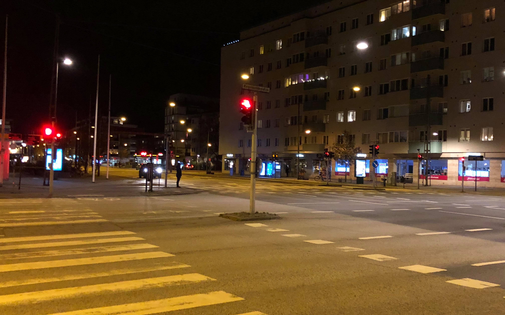

Alla talar om coronaviruset *på ett eller annat sätt*, från individer på sociala sätt till jobbet, till statliga myndigheterna. Efter att jobba hemifrån, en man som heter Josefsson har en sak att göra, - en sak att bevisa. Han behöver ett nytt klarsynt.

***>> Promenaden***

På onsdags tog jag och min fru en promenad runt Malmö. Vi gick från kronprinsen området längs Regementsgatan och sen söder österut via Carl Gutstavs väg till Södervärn. Alla gator var nakna i stan, avskalade av alla glada människor som gick dem tidigare. Det var inte ett problem att hålla en socialdistans med andra personer - det fanns ju ingen på gatorna. Det såg ut som Lund på sommaren 😀😀😀😀. Det var tyst men lugn och skönt på gatorna.

|  |  |
| *Kaptensgatan* | *Mot centralen* |

|  |  |
|*Neptunigatan* | *Mariedalsvägen* |

På tågstationerna och busshållplatserna var också nästan tomma.

|  |  |
| *Central tågstation* | *Central tågstation* |

|  |  |
|*Triangeln tågstation* | *Central bussstation* |

Till slut var 10km slutförde. Glöm det, titta själv på videon långt ner på sidan!

***>> En stund i olika butiker***

Under promenaden vile vi köpa några grejer som ris och pasta - inte för mycket utan bara tillräckligt, lagom. Milda makter!!! I de fem olika butikerna vi gick in fanns ingen toapapper, ingen pasta och ingen ris. Vi kom ut tomhänt från butikerna. Vad börde man göra om man inte kan hitta ris, pasta, och toapapper i butikerna? Det verkar lättare att hitta saffran än de där väsentligare saker. Skit är verkligt. Nu ger coronaviruset mig rysningarna.

|  |  |
| *Ingen toapapper* | *Ingen pasta* |

Äntligen, dagen därpå hittade vi några ris på butiken ICA. Det var uppenbarligen ICA Basic ris.

|  |  |
|*ICA Basic ris* | *Grönsaker* |

 
***>> Promenaden video***

<iframe width="560" height="315" src="https://www.youtube.com/embed/-60SjQXGaKw" frameborder="1" allow="accelerometer; autoplay; encrypted-media; gyroscope; picture-in-picture" allowfullscreen></iframe>
