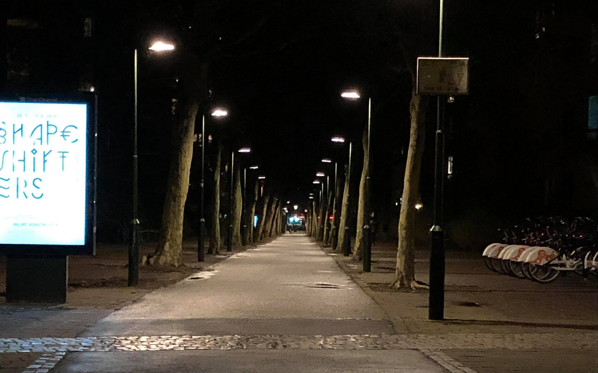

Alla talar om coronaviruset *på ett eller annat sätt*, från individer på sociala sätt till jobbet, till statliga myndigheterna. Vad börde man göra om man inte kan hitta ris, pasta, och toapapper i butikerna? Det är verkar lättare att hitta saffran än de där väsentligare saker. Skit är verkligt. Coronaviruset ger mig rysningarna.

***>> Promenaden***

På onsdags tog jag och min fru en promenad runt **Malmö**. Vi gick från kronprinsen området längs regementsgatan och sen söder österut via Carl Gutstavs väg till Södervarn. Alla gator var nakna i stan, avskalade av alla glada människor som gick dem tidigare.

|  |  |
| *Kaptensgatan* | *Mot centralen* |

|  |  |
|*Neptunigatan* | *Mariedalsvägen* |

På tågstationerna och busshållplatserna var också nästan tomma.

|  |  |
| *Central tågstation* | *Central tågstation* |

|  |  |
|*Triangeln tågstation* | *Central bussstation* |

Till slut var 10km slutförde. Glöm det, titta själv på videon långt ner på sidan!

***>> En stund i olika butiker***

Under promenad vile vi köpa några grejer som ris och pasta - inte för mycket utan bara tillräckligt, lagom.

|  |  |
| *Ingen toapapper* | *Ingen pasta* |

|  |  |
|*ICA Basic ris* | *Grönsaker* |

Nu ger Jag kan inte längre tyst.

Tragedier gör en klarsynt.

***>> Promenaden karta***

<iframe width="560" height="315" src="https://www.youtube.com/embed/-60SjQXGaKw" frameborder="0" allow="accelerometer; autoplay; encrypted-media; gyroscope; picture-in-picture" allowfullscreen></iframe>
