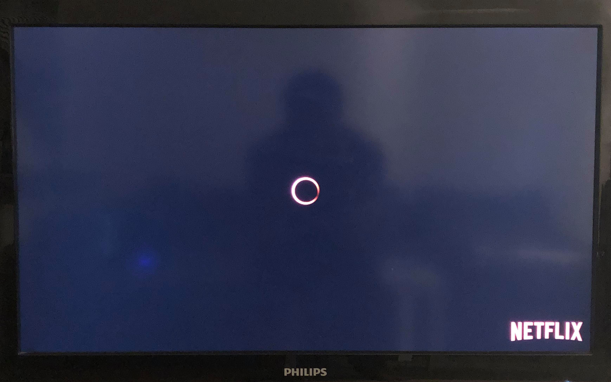
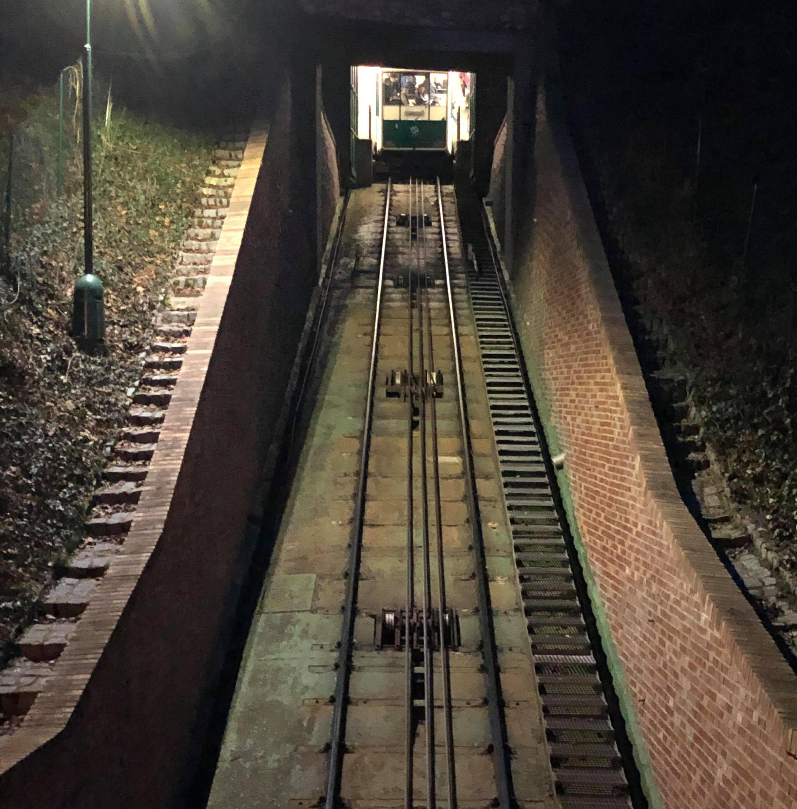

Lördag! En dag efter att jobba hemifrån i tre långa hektiska veckor. Coronakrisen vägrar att avsluta men det blir värre istället.

***>> Vilken fint lördag***

Numera är lördagen mycket länge väntat åt barn för goddisskull men också åt vuxna för att koppla av från karantänen. Solen skiner, det blåser men bara litet, människor motionerar, soffpotatisar tittar på tv, *vi tittar på tv*, alla är glada. Vilken fint dag!

***>> Tidig kväll***

Ett, tu, tre, vid klockan sex e.m. - INGEN SIGNAL! på tv:n p.g.a. [störningar hos Telias internetuppkopplingen över hela Sverige](https://www.aftonbladet.se/nyheter/a/AdwE9n/stora-tekniska-problem-hos-telia-over-hela-landet){:target="_blank"}.

Vi kollar på;
- *SVT på tv:n - **Inget!***
- *Netflix på tv:n - **Inget!***
- *Svtplay.se via en dator - **Inget!***
- *Netflix via en dator - **Inget!***
- *Facebook via en dator - **Inget!***
- *Facebook via min mobiltelefon - **Inget!***
- *Facebook via fruns mobiltelefon - **Inget!***

***>> Senare***

Vi går till balkongen och tittar nedför på gatorna. Det finns ingen precis nu. Vilken tystnad!
Är det ett utegångsförbud? Är det ett lockdown? Näääääää! kanske det är en *ry**** invasion mot Sverige.

Vi väntade för en [Hesa Fredrik](http://hesafredrik.nu/vem-ar-hesa-fredrik){:target="_blank"} som vi inte hörde.
Vi är smarta och vi är alltid förberedd!

1. Gå inomhus - Redan där!
1. Stänga alla dörrar, fönster och ventilation - kontrollerat!
1. Lyssna på Sveriges Radio P4 (för [VMA](https://www.krisinformation.se/detta-gor-samhallet/vma-sa-varnas-allmanheten){:target="_blank"}) - misslyckades!

> *Man måste köpa en batteridriven radio.*

***>> Bunkerkontrollen***

Under tiden, kollade vi på våra nödsituationens saker - i vår 55 kvm lägenhet *(bunker ett)*;

- Pasta och Pastasås - Kan ransonera till en vecka.
- Ris - Kan ransonera till en vecka.
- Grönsaker - Kan ransonera till en vecka.
- Kött såker - Kan ransonera till en vecka.
- Vatten - Det flyter från kranen. Hmmm!
- Toapapper - ~~Ett rum.~~

Överlevande under vår bunker ett - ~~en månad~~, två veckor per person!

Medan frun kontrollerade allt i bunker ett, tänkte jag att gå nedåt till förrådet - bunker två.

&nbsp;&nbsp;&nbsp;&nbsp;&nbsp;&nbsp;&nbsp;&nbsp;

&nbsp;&nbsp;&nbsp;&nbsp;&nbsp;&nbsp;&nbsp;&nbsp;*Någonstans ner till bunkeren.* 

***>> Verkligheten***

Josefsson! Josefsson! ropade min fru.

Ju mer jag gick ner desto svagare blev hennes röst.

> *Fru*: Josefsson! 
> *Jag*: Hmmm! Jaaa! 
> *Fru*: Allt bra? Du skrek på svenska i din sömn.  
> *Jag*: Vad! 
