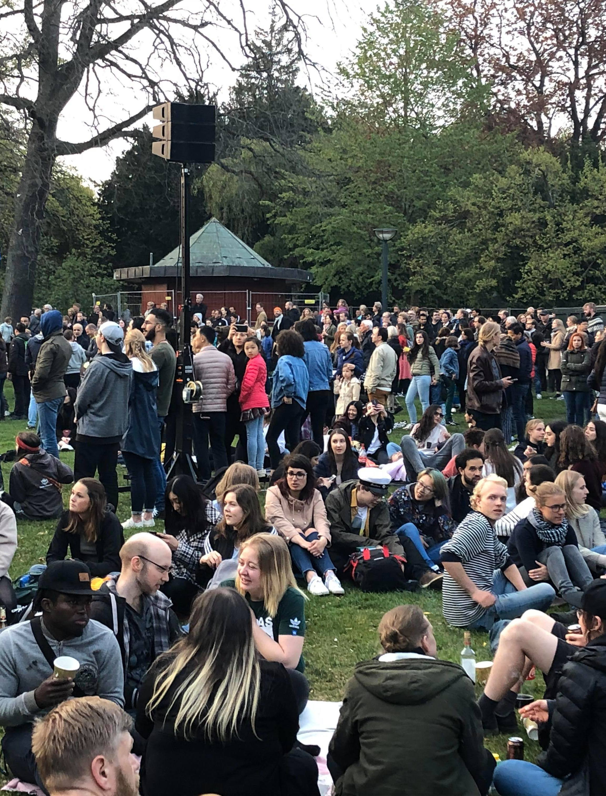
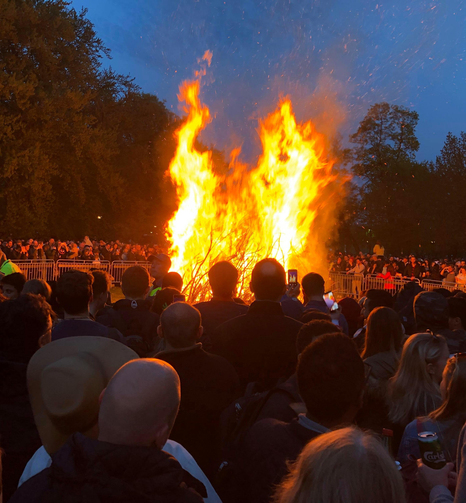
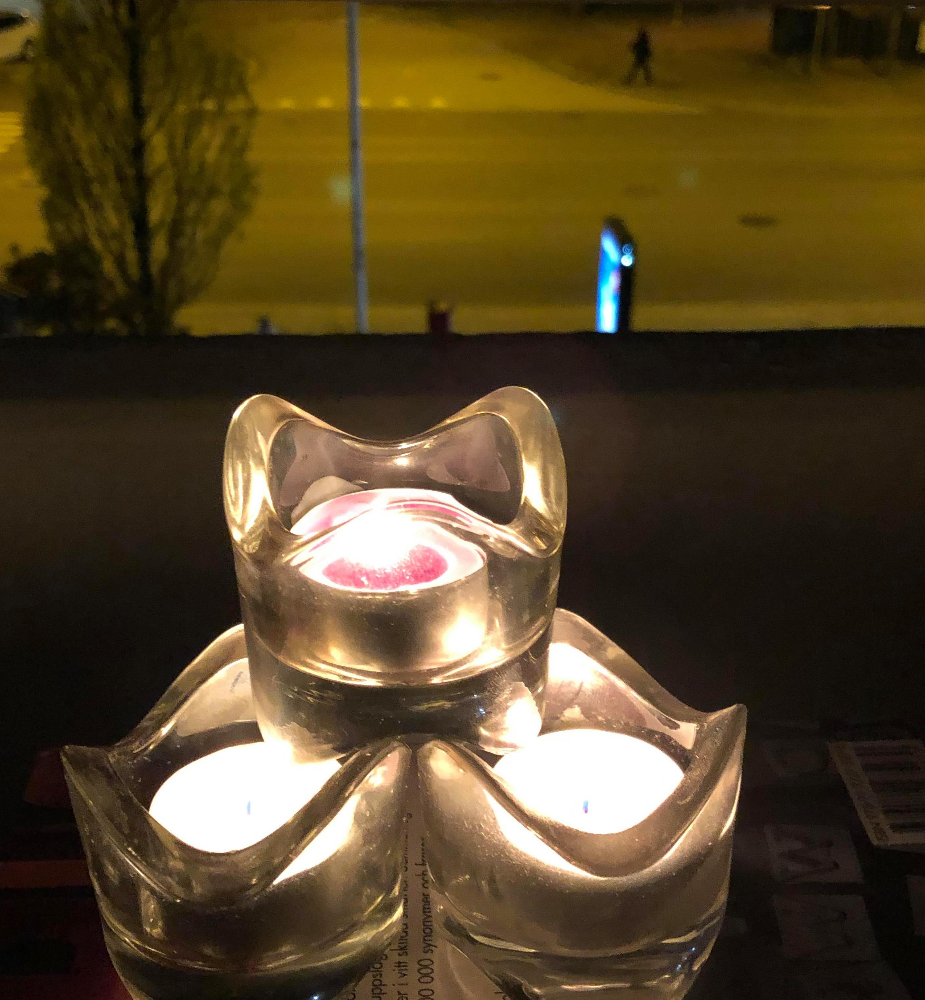

Det är eftermiddagen på den 30:e April men det finns något annorlunda. Faktiskt, det är helt annorlunda i alla fall. Det är tyst på gatorna, parkerna i staden är stängda och ändå är det det valborgsmässoafton [^1].

Jag går ut på balkongen och om en stund, blundar jag och allt blir klart. Jag och frun träffar vid Lunds Domkyrkan och går ner via *Stora Södergatan* tills *Stadsparken*. Det finns mycket och glada folk. Det finns poliserna på hästarna, några på cyklar och bilar och resten på tills fots.

> *Fru*: Är vi i Peking?  
> *Jag*: Hahaha, typ!

Det finns några föreställningar på scenen och folksångarna är vackra. Snart är det dags för att bränna bål och alla är redo att spela in evenemanget med telefonerna.

|  |   Att gödsla gräsmattor med hönsgödsel. *Foto: Johan Nilsson/TT, [https://www.bt.se/](https://www.bt.se/nyheter/valborgsfirare-i-lund-far-ta-sitt-ansvar/){:target="_blank"}*   Att sprida ut hönsgödsel i parken.  *Källa: [https://www.skd.se/sydvastskane/](https://www.skd.se/2020/04/30/lugn-valborg-men-massiv-bevakning/){:target="_blank"}* |
| *Valborgsmässoafton 2019, Lund Stadsparken* | *Valborgsmässoafton 2020, Lund Stadsparken*|

<iframe width="560" height="315" src="https://www.youtube.com/embed/BCke9J_8ktY" frameborder="0" allow="accelerometer; autoplay; encrypted-media; gyroscope; picture-in-picture" allowfullscreen></iframe>

När jag öppnar ögonen, tittar jag på vår årets firande. Inte så mycket folk utan jag och frun på balkongen. Det finns ju ett ton hönsbajs i Lund stadsparken [^2].

|  |  |
| *Valborgsmässoafton 2019, Lund Stadsparken* | *Valborgsmässoafton 2020* |

<video width="500" height="300" autoplay loop><source src="../images/10/valborg_2020.mp4" type="video/mp4">Your browser does not support the video tag.</video>

[^1]: [Valborgsmässoafton](https://sv.wikipedia.org/wiki/Valborgsm%C3%A4ssoafton){:target="_blank"}
[^2]: [Ett ton hönsbajs och polisdrönare i Lund stadsparken](https://www.svt.se/nyheter/lokalt/skane/ett-ton-honsbajs-och-polisdronare-sa-ska-festen-i-lund-stoppas){:target="_blank"}
