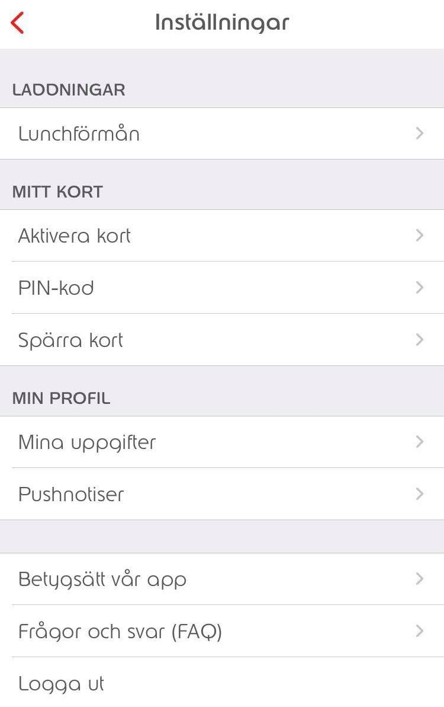
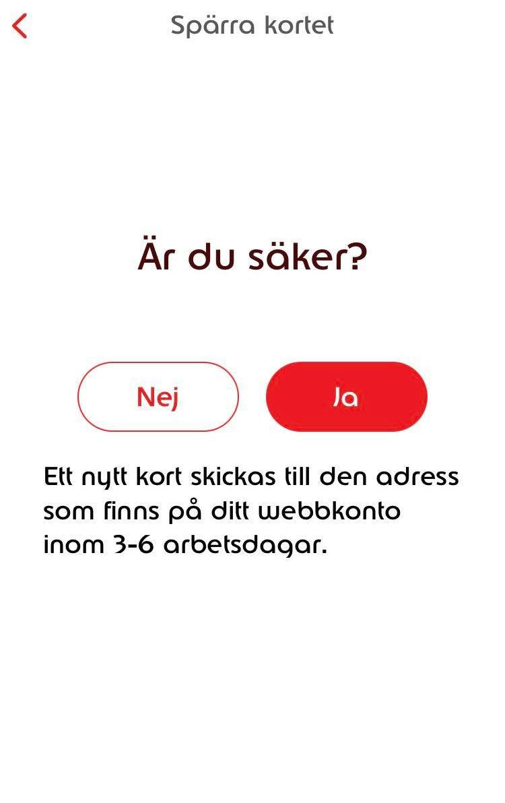

Att lära sig ett språk är något för de som vågar - de modiga.

Jag kommer ihåg mina första dagar på jobbet i sverige. Så mycket hände - jag träffade de nya arbetskamrater, jag fick en arbetstelefon och dator och allt annat precis som på ett typiskt svenskt företag.

Jag fick ett rikskuponger[^1] lunchkort och jag laddade ner den MyEdenred appen på mobilen. Man kan ju kontrollera allt på mobilen, visste jag. Även om man inte vet verkligen vad man gör och det tänkte jag inte på.

### MyEdenred appen

> Appen var på svenska och jag gick genom alla appens funktioner.

Att *Aktivera kortet* gick snabbt och enkelt och då tyckte jag att jag skulle klara allt på samma sätt - helt enkelt. I alla fall hade jag varit student på Svenska För Invandrare ~~Invånare~~ (SFI), på Komvux för några veckor. Så jag var väldigt säker på min språkförmåga. Vad kunde gå fel?

Att ändra *PIN-kod* gick lika bra.

*Lunchförmån* - det mest betydande sak just då. Det tog ett tag på vilka 11 månader jag ville ha lunchförmån för. Det slutade självklart med att jag valde alla månader utom den enda jag inte kunde välja - månaden därpå. Det var mitt av månaden och tidsfristen för att välja månaden därpå hade gått. Att **spara** ändringarna, kontrollerade!

|  |  |
| *App inställningar* | *Spärra kortet* |

Sist men inte minst, att ***Spärra*** *kortet*. Efter alla funktionstester ovan, tänkte jag att det var ett kanon ide att **spara** alla ändringarna.

> *Bekräftelsemeddelande*: Är du säker?  
> *Jag*: Ja visst!   
&nbsp;&nbsp;&nbsp;&nbsp;>> *medan jag trycka på knappen*

Och det är så jag  
&nbsp;&nbsp;&nbsp;&nbsp;&nbsp;&nbsp;&nbsp;&nbsp;&nbsp;&nbsp;&nbsp;&nbsp;&nbsp;&nbsp;&nbsp;&nbsp;&nbsp;&nbsp;&nbsp;&nbsp;&nbsp;&nbsp;&nbsp;&nbsp; <i>förstörde  
&nbsp;&nbsp;&nbsp;&nbsp;&nbsp;&nbsp;&nbsp;&nbsp;&nbsp;&nbsp;&nbsp;&nbsp;&nbsp;&nbsp;&nbsp;&nbsp;&nbsp;&nbsp;&nbsp;&nbsp;&nbsp;&nbsp;&nbsp;&nbsp;
&nbsp;&nbsp;&nbsp;&nbsp;&nbsp;&nbsp;&nbsp;&nbsp; mitt kort  
&nbsp;&nbsp;&nbsp;&nbsp;&nbsp;&nbsp;&nbsp;&nbsp;&nbsp;&nbsp;&nbsp;&nbsp;&nbsp;&nbsp;&nbsp;&nbsp;&nbsp;&nbsp;&nbsp;&nbsp;&nbsp;&nbsp;&nbsp;&nbsp;
&nbsp;&nbsp;&nbsp;&nbsp;&nbsp;&nbsp;&nbsp;&nbsp;
&nbsp;&nbsp;&nbsp;&nbsp;&nbsp;&nbsp;&nbsp;&nbsp; innan det kunde användas!  

### Vad gick fel

Flera år senare sitter jag med slokande ögon och en morot i mungipan medan jag **spårar** skillnaden mellan **spara** och **spärra**. Jo! 'a', 'å' och 'ä' är inte samma sak.

[^1]: [Rikskuponger, MyEdenred](https://www.edenred.se/vara-formaner/lunchforman/){:target="_blank"}
